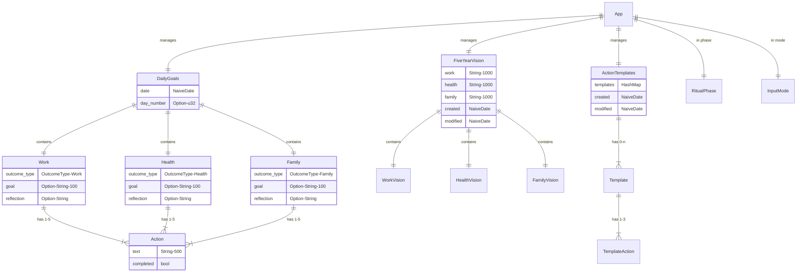

# FocusFive Data Model - Visual Representation

## Entity Relationship Diagram



## Class Hierarchy Diagram

```
┌─────────────────────────────────────────────────────────┐
│                     App (Main State)                     │
├─────────────────────────────────────────────────────────┤
│ + goals: DailyGoals                                     │
│ + vision: FiveYearVision                                │
│ + templates: ActionTemplates                            │
│ + config: Config                                        │
│ + ritual_phase: RitualPhase                            │
│ + input_mode: InputMode                                │
│ + active_pane: Pane                                    │
│ + current_streak: u32                                  │
│ + completion_stats: Option<CompletionStats>            │
└─────────────────────────────────────────────────────────┘
                            │
        ┌───────────────────┼───────────────────┐
        ▼                   ▼                   ▼
┌──────────────┐   ┌──────────────┐   ┌──────────────┐
│  DailyGoals  │   │FiveYearVision│   │ActionTemplates│
├──────────────┤   ├──────────────┤   ├──────────────┤
│ date         │   │ work         │   │ templates    │
│ day_number   │   │ health       │   │ created      │
│ work         │   │ family       │   │ modified     │
│ health       │   │ created      │   └──────────────┘
│ family       │   │ modified     │
└──────────────┘   └──────────────┘
        │
        ▼
┌──────────────┐
│   Outcome    │ (x3: Work, Health, Family)
├──────────────┤
│ outcome_type │──────→ OutcomeType (enum)
│ goal         │        ├─ Work
│ actions[]    │        ├─ Health
│ reflection   │        └─ Family
└──────────────┘
        │
        ▼
┌──────────────┐
│    Action    │ (1-5 per Outcome)
├──────────────┤
│ text         │ (max 500 chars)
│ completed    │ (boolean)
└──────────────┘
```

## Data Flow Diagram

```
┌─────────────────────────────────────────────────────────┐
│                    User Interface (TUI)                  │
└─────────────────────────────────────────────────────────┘
                            │
                            ▼
┌─────────────────────────────────────────────────────────┐
│                    App State Manager                     │
│  ┌─────────────┐  ┌──────────────┐  ┌──────────────┐  │
│  │ Input Mode  │  │ Ritual Phase │  │     Pane     │  │
│  └─────────────┘  └──────────────┘  └──────────────┘  │
└─────────────────────────────────────────────────────────┘
                            │
        ┌───────────────────┼───────────────────┐
        ▼                   ▼                   ▼
┌──────────────┐   ┌──────────────┐   ┌──────────────┐
│  Core Data   │   │   Visions    │   │  Templates   │
│ (DailyGoals) │   │(FiveYearVision)  │(ActionTemplates)
└──────────────┘   └──────────────┘   └──────────────┘
        │                   │                   │
        ▼                   ▼                   ▼
┌─────────────────────────────────────────────────────────┐
│                  File System (data.rs)                   │
├─────────────────────────────────────────────────────────┤
│  ~/FocusFive/goals/YYYY-MM-DD.md  (Markdown)           │
│  ~/FocusFive/visions/vision.json   (JSON)              │
│  ~/.focusfive_templates.json       (JSON)              │
└─────────────────────────────────────────────────────────┘
```

## State Machine Diagram (Input Modes)

```
                    ┌────────┐
                    │ Normal │◄──────────────────┐
                    └────┬───┘                   │
                         │                        │
         ┌───────────────┼───────────────┐       │ Esc/Save
         │               │               │       │
         ▼               ▼               ▼       │
    ┌─────────┐    ┌────────────┐  ┌────────────┐
    │ Editing │    │GoalEditing │  │VisionEditing
    └─────────┘    └────────────┘  └────────────┘
         │               │               │
         └───────────────┴───────────────┘
                         
                    ┌────────┐
                    │ Normal │
                    └────┬───┘
                         │
         ┌───────────────┼───────────────┐
         ▼               ▼               ▼
┌──────────────┐  ┌──────────────┐  ┌──────────────┐
│CopyFromYester│  │TemplateSaving│  │ Reflecting   │
└──────────────┘  └──────────────┘  └──────────────┘
```

## Ritual Phase Timeline

```
Time    00:00 ─────► 05:00 ─────► 12:00 ─────► 17:00 ─────► 23:00 ─────► 00:00
Phase     None        Morning       None        Evening       None         None

Morning (5am-12pm):
├─ Show yesterday's incomplete tasks
├─ Apply templates (1-9 keys)
├─ Set daily intentions
└─ Edit goals and actions

Evening (5pm-11pm):
├─ Quick complete with letter keys (a-z)
├─ Show completion statistics
├─ Write reflection
└─ Review progress
```

## Constraint Visualization

```
┌─────────────────────────────────────────────────┐
│                 FIXED CONSTRAINTS                │
├─────────────────────────────────────────────────┤
│ • EXACTLY 3 Outcomes (Work, Health, Family)     │
│ • OutcomeType enum = 3 variants only            │
│ • Cannot add/remove outcomes                    │
└─────────────────────────────────────────────────┘

┌─────────────────────────────────────────────────┐
│               VARIABLE CONSTRAINTS               │
├─────────────────────────────────────────────────┤
│ • Actions per outcome: 1 ≤ n ≤ 5               │
│ • Action text: 0 ≤ length ≤ 500                │
│ • Goal text: 0 ≤ length ≤ 100                  │
│ • Vision text: 0 ≤ length ≤ 1000               │
│ • Templates per set: 0 ≤ n ≤ ∞                 │
│ • Actions per template: 1 ≤ n ≤ 3              │
└─────────────────────────────────────────────────┘
```

## Memory Layout

```
DailyGoals Structure (~2KB):
┌────────────────────────────────┐
│ date: NaiveDate (12 bytes)     │
│ day_number: Option<u32> (8)    │
├────────────────────────────────┤
│ Work Outcome (~600 bytes)      │
│  ├─ outcome_type: enum (1)     │
│  ├─ goal: Option<String> (124) │
│  ├─ actions: Vec<Action>       │
│  │   └─ 1-5 x Action (~100ea)  │
│  └─ reflection: Option<String>  │
├────────────────────────────────┤
│ Health Outcome (~600 bytes)    │
│  └─ (same structure)           │
├────────────────────────────────┤
│ Family Outcome (~600 bytes)    │
│  └─ (same structure)           │
└────────────────────────────────┘

Action Structure (~100 bytes):
┌────────────────────────────────┐
│ text: String (≤500 chars)      │
│ completed: bool (1 byte)       │
└────────────────────────────────┘
```

## File Format Mapping

```
Markdown ──────► Parser ──────► DailyGoals
                   │                 │
# Date             │            date + day_number
## Outcome (Goal)  │            outcome + goal
- [ ] Action       │            action + completed
                   │                 │
DailyGoals ──────► Formatter ──────► Markdown
```

---

These visual representations show the complete data model structure, relationships, constraints, and flow through the FocusFive application. The model enforces the "3 outcomes" constraint at the type level while allowing flexibility in action counts (1-5) and optional fields.