# FocusFive UX/UI Flow Diagram

## User Experience & Interface Flow

```mermaid
graph TB
    %% Main Screen Layout
    subgraph MainScreen[" 📱 Main Terminal Screen "]
        Header["Header Bar<br/>☀️ Morning Ritual · August 28, 2025 - Day 7 · 🔥 7 day streak"]
        
        subgraph SplitView[" Split View Layout "]
            subgraph OutcomesPane[" LEFT PANE - Outcomes 40% "]
                WorkOutcome["▶ Work Goal: Ship v2.0<br/>✓✓○ 2/3 completed"]
                HealthOutcome["Health Goal: Run 5K<br/>✓○○ 1/3 completed"]
                FamilyOutcome["Family Goal: Be present<br/>○○○ 0/3 completed"]
            end
            
            subgraph ActionsPane[" RIGHT PANE - Actions 60% "]
                Action1["✓ Review PRs<br/>⟂ Q4 Launch"]
                Action2["→ Write docs<br/>⟂ Q4 Launch"]
                Action3["○ Deploy staging"]
                Action4["+ Add action 4/5"]
                Action5["+ Add action 5/5"]
            end
        end
        
        Footer["Tab: Switch · Space: Toggle · o: Link Objective · t: Templates · y: Yesterday"]
    end
    
    %% Action States & Transitions
    subgraph ActionStates[" 🔄 Action Status Flow "]
        Planned["○ Planned<br/>Empty checkbox"]
        InProgress["→ In Progress<br/>Arrow indicator"]
        Done["✓ Done<br/>Checkmark"]
        Skipped["~ Skipped<br/>Tilde mark"]
        Blocked["✗ Blocked<br/>X mark"]
        
        Planned -->|Space key| InProgress
        InProgress -->|Space key| Done
        Done -->|Space key| Skipped
        Skipped -->|Space key| Blocked
        Blocked -->|Space key| Planned
    end
    
    %% Navigation Flow
    subgraph NavigationFlow[" 🧭 Navigation States "]
        OutcomeSelected["Outcome Selected<br/>Work highlighted"]
        ActionSelected["Action Selected<br/>Review PRs highlighted"]
        
        OutcomeSelected -->|Tab key| ActionSelected
        ActionSelected -->|Tab key| OutcomeSelected
        
        OutcomeSelected -->|j/k or ↓/↑| OutcomeNavigation["Navigate Outcomes<br/>Work → Health → Family"]
        ActionSelected -->|j/k or ↓/↑| ActionNavigation["Navigate Actions<br/>1-5 variable actions"]
    end
    
    %% Action Management
    subgraph ActionManagement[" ⚙️ Action Configuration "]
        subgraph DynamicActions[" Variable Actions Per Outcome "]
            OneAction["Minimum Config<br/>□ Single action"]
            ThreeActions["Default Config<br/>□ Action 1<br/>□ Action 2<br/>□ Action 3"]
            FiveActions["Maximum Config<br/>□ Action 1<br/>□ Action 2<br/>□ Action 3<br/>□ Action 4<br/>□ Action 5"]
        end
        
        AddRemove["+ Add up to 5<br/>- Remove down to 1"]
    end
    
    %% Objective Linking Flow
    subgraph ObjectiveLinking[" 🎯 Objective Management "]
        ActionNoObj["□ Write documentation"]
        PressO["Press 'o' key"]
        ObjectiveModal["Select Objective Modal<br/>────────────────<br/>▶ Q4 Product Launch<br/>  Documentation Sprint<br/>  Technical Debt<br/>────────────────<br/>n: Create New"]
        LinkedAction["□ Write documentation<br/>⟂ Q4 Product Launch"]
        
        ActionNoObj -->|o key| PressO
        PressO --> ObjectiveModal
        ObjectiveModal -->|Enter| LinkedAction
        ObjectiveModal -->|n key| CreateObjective["New Objective<br/>Title: ___________"]
    end
    
    %% Template System
    subgraph TemplateFlow[" 📋 Template System "]
        EmptyActions["Empty Day<br/>□ _____<br/>□ _____<br/>□ _____"]
        PressT["Press 't' key"]
        TemplateSelect["Template Browser<br/>────────────────<br/>1. Morning Routine 3<br/>2. Deep Work Day 4<br/>3. Meeting Heavy 2<br/>────────────────<br/>T: Save Current"]
        FilledActions["Filled from Template<br/>□ Morning standup<br/>□ Code review<br/>□ Write tests"]
        
        EmptyActions -->|t key| PressT
        PressT --> TemplateSelect
        TemplateSelect -->|1-9 keys| FilledActions
        
        CurrentActions["Current Actions<br/>□ Review PRs<br/>□ Write docs<br/>□ Deploy"]
        CurrentActions -->|T key| SaveTemplate["Save as Template<br/>Name: ___________"]
    end
    
    %% Yesterday Copy Flow
    subgraph YesterdayFlow[" 📅 Yesterday Integration "]
        TodayEmpty["Today Empty<br/>□ _____<br/>□ _____<br/>□ _____"]
        PressY["Press 'y' key"]
        YesterdayModal["Yesterday's Actions<br/>────────────────<br/>☑ ✓ Review PRs<br/>☑ ○ Write docs<br/>☐ ✓ Family dinner<br/>────────────────<br/>Space: Toggle · Enter: Apply"]
        TodayFilled["Today Prefilled<br/>□ Write docs<br/>□ _____<br/>□ _____"]
        
        TodayEmpty -->|y key| PressY
        PressY --> YesterdayModal
        YesterdayModal -->|Enter| TodayFilled
    end
    
    %% Time-based UI Changes
    subgraph TimeBasedUI[" 🕐 Ritual Phases "]
        subgraph MorningUI[" ☀️ Morning 5am-12pm "]
            MorningColors["Yellow/Green Theme"]
            MorningPrompts["Focus: Planning<br/>Quick Templates 1-9<br/>Yesterday Copy"]
            MorningHeader["☀️ Morning Ritual"]
        end
        
        subgraph EveningUI[" 🌙 Evening 5pm-11pm "]
            EveningColors["Blue/Magenta Theme"]
            EveningPrompts["Focus: Completion<br/>Progress Gauge<br/>Reflection Mode"]
            EveningHeader["🌙 Evening Review<br/>══════════ 67%"]
        end
        
        TimeCheck{System Time}
        TimeCheck -->|5am-12pm| MorningUI
        TimeCheck -->|5pm-11pm| EveningUI
    end
    
    %% Modal Overlays
    subgraph ModalSystem[" 🪟 Modal Overlays "]
        NormalView["Normal View"]
        
        NormalView -->|e key| EditModal["Edit Action<br/>┌─────────────┐<br/>│Current text │<br/>│___________ │<br/>│ESC · Enter │<br/>└─────────────┘"]
        
        NormalView -->|g key| GoalEditModal["Edit Goal<br/>┌─────────────┐<br/>│Ship v2.0___ │<br/>│100 char max │<br/>└─────────────┘"]
        
        NormalView -->|r key| ReflectionModal["Reflection<br/>┌─────────────┐<br/>│How did work │<br/>│go today?___ │<br/>│Multi-line   │<br/>└─────────────┘"]
        
        NormalView -->|i key| IndicatorModal["Indicators<br/>┌─────────────┐<br/>│Lines of code│<br/>│Value: _____ │<br/>│Unit: Count  │<br/>└─────────────┘"]
    end
    
    %% Quick Actions
    subgraph QuickActions[" ⚡ Keyboard Shortcuts "]
        subgraph CoreNav[" Essential Navigation "]
            Tab["Tab - Switch panes"]
            JK["j/k - Move up/down"]
            Space["Space - Toggle status"]
            Quit["q - Save & quit"]
        end
        
        subgraph ActionMgmt[" Action Management "]
            Edit["e - Edit action text"]
            Goal["g - Edit goal text"]
            Template["t/T - Use/Save template"]
            Yesterday["y - Copy yesterday"]
            Objective["o - Link objective"]
        end
        
        subgraph Advanced[" Advanced Features "]
            Indicator["i - Manage indicators"]
            Reflection["r - Add reflection"]
            Plus["+ - Add action up to 5"]
            Minus["- - Remove action down to 1"]
            Unlink["n - Unlink objective"]
        end
    end
    
    %% User Journey Example
    subgraph UserJourney[" 👤 Typical User Flow "]
        Start["Open FocusFive<br/>6:00 AM"]
        MorningCheck["See yesterday incomplete<br/>Press 'y'"]
        SelectIncomplete["Select incomplete tasks<br/>Space to toggle"]
        ApplyYesterday["Apply to today<br/>Enter"]
        NavigateWork["Tab to actions<br/>Navigate to Work"]
        CompleteAction["Complete morning task<br/>Space to mark done"]
        LinkObjective["Link to Q4 Launch<br/>Press 'o'"]
        SaveProgress["Auto-save triggered"]
        
        Start --> MorningCheck
        MorningCheck --> SelectIncomplete
        SelectIncomplete --> ApplyYesterday
        ApplyYesterday --> NavigateWork
        NavigateWork --> CompleteAction
        CompleteAction --> LinkObjective
        LinkObjective --> SaveProgress
    end
    
    %% Relationships
    MainScreen -.-> NavigationFlow
    MainScreen -.-> ActionStates
    ActionsPane --> ObjectiveLinking
    ActionsPane --> TemplateFlow
    MainScreen --> ModalSystem
    TimeCheck -.-> MainScreen
    
    style MainScreen fill:#e3f2fd
    style ActionStates fill:#f3e5f5
    style NavigationFlow fill:#e8f5e9
    style ObjectiveLinking fill:#fff3e0
    style TemplateFlow fill:#fce4ec
    style YesterdayFlow fill:#f1f8e9
    style TimeBasedUI fill:#fff9c4
    style ModalSystem fill:#e0f2f1
    style QuickActions fill:#f5f5f5
    style UserJourney fill:#e1f5fe
```



## Screen States & Interactions

### Main Screen Components

#### Header Bar
- **Morning Mode** (5am-12pm): ☀️ icon, yellow/green theme, "Morning Ritual" text
- **Evening Mode** (5pm-11pm): 🌙 icon, blue/magenta theme, progress gauge
- **Always Shows**: Current date, day counter, streak indicator

#### Left Pane - Outcomes (40% width)
```
▶ Work (Goal: Ship v2.0)    [2/3] ✓✓○
  Health (Goal: Run 5K)      [1/3] ✓○○
  Family (Goal: Be present)  [0/3] ○○○
```
- Selected outcome highlighted with ▶ indicator
- Shows goal text in parentheses
- Visual progress indicators showing completion

#### Right Pane - Actions (60% width)
```
[✓] Review PRs                 ⟂ Q4 Launch
[→] Write documentation        ⟂ Q4 Launch  
[○] Deploy to staging
[+] Add action (4 of 5)
[+] Add action (5 of 5)
```
- Status indicators: ○ (planned), → (in progress), ✓ (done), ~ (skipped), ✗ (blocked)
- Objective linkage shown with ⟂ symbol
- Dynamic action count (1-5 per outcome)

### Interaction Flows

#### 1. Daily Planning Flow (Morning)
```
Open app → See empty day → Press 'y' for yesterday →
Select incomplete items → Apply to today → 
Optional: Apply template for remaining slots →
Link actions to objectives → Begin work
```

#### 2. Progress Tracking Flow (During Day)
```
Navigate to action → Press Space to cycle status →
Planned → In Progress → Done →
Auto-save triggers → Streak updates
```

#### 3. Evening Review Flow
```
Open app → See progress gauge → 
Complete remaining actions → Press 'r' for reflection →
Add outcome-specific reflections → 
Review completion statistics
```

### Modal Overlays

#### Template Selection Modal
```
┌──────────────────────────────┐
│   Select Template            │
├──────────────────────────────┤
│ 1. Morning Routine    [3]    │
│ 2. Deep Work Day      [4]    │
│ 3. Meeting Heavy      [2]    │
│ 4. Exercise Focus     [3]    │
├──────────────────────────────┤
│ [1-9] Select | [Esc] Cancel  │
└──────────────────────────────┘
```

#### Objective Linking Modal
```
┌──────────────────────────────┐
│   Link to Objective          │
├──────────────────────────────┤
│ ▶ Q4 Product Launch          │
│   Documentation Sprint        │
│   Technical Debt Reduction   │
│   Team Training              │
├──────────────────────────────┤
│ [↑↓] Nav | [Enter] Link      │
│ [n] New | [Esc] Cancel       │
└──────────────────────────────┘
```

#### Yesterday Copy Modal
```
┌──────────────────────────────┐
│   Copy from Yesterday        │
├──────────────────────────────┤
│ ☑ [○] Write documentation    │
│ ☑ [○] Review PRs             │
│ ☐ [✓] Team standup          │
│ ☑ [○] Fix bug #123          │
├──────────────────────────────┤
│ [Space] Toggle | [Enter] OK  │
└──────────────────────────────┘
```
- Pre-selects incomplete items
- Shows yesterday's status in brackets

### Variable Action Management

#### Minimum Configuration (1 action)
```
Work (Goal: Deep focus)
  [○] Single critical task
```

#### Default Configuration (3 actions)
```
Work (Goal: Balanced day)
  [○] Morning task
  [○] Afternoon task
  [○] End of day task
```

#### Maximum Configuration (5 actions)
```
Work (Goal: High volume)
  [✓] Task 1
  [→] Task 2
  [○] Task 3
  [○] Task 4
  [○] Task 5
```

### Keyboard-Driven Interface

#### Navigation Layer
- **Tab**: Toggle between Outcomes and Actions panes
- **j/k or ↓/↑**: Navigate within current pane
- **Space**: Cycle action status (only in Actions pane)

#### Action Layer
- **e**: Edit selected action text (500 char limit)
- **g**: Edit outcome goal (100 char limit)
- **+/-**: Add/remove actions (1-5 range)

#### Feature Layer
- **o**: Link/unlink objective
- **t**: Apply template
- **T**: Save current as template
- **y**: Copy from yesterday
- **i**: Manage indicators
- **r**: Add reflection
- **n**: Unlink from objective

#### System Layer
- **q**: Save all and quit
- **Esc**: Cancel current modal
- **Enter**: Confirm modal action

### Time-Based UI Adaptations

#### Morning Phase (5am-12pm)
- Focus on planning and intention setting
- Shortcuts emphasized: templates (1-9), yesterday copy (y)
- Encouraging messages: "What will you accomplish today?"

#### Evening Phase (5pm-11pm)
- Focus on completion and reflection
- Progress gauge prominently displayed
- Quick completion shortcuts (1-9, a-f for up to 15 actions)
- Reflection prompts: "How did your day go?"

### Success Indicators

1. **Visual Feedback**
   - Color changes on status updates
   - Progress bars for completion
   - Streak counter animation

2. **Completion Metrics**
   - Per-outcome completion: "Work [2/3]"
   - Overall percentage: "Today: 67%"
   - Best performer highlighting

3. **Objective Alignment**
   - ⟂ symbol shows linked objectives
   - Consistent objective tracking across days
   - Progress toward long-term goals visible