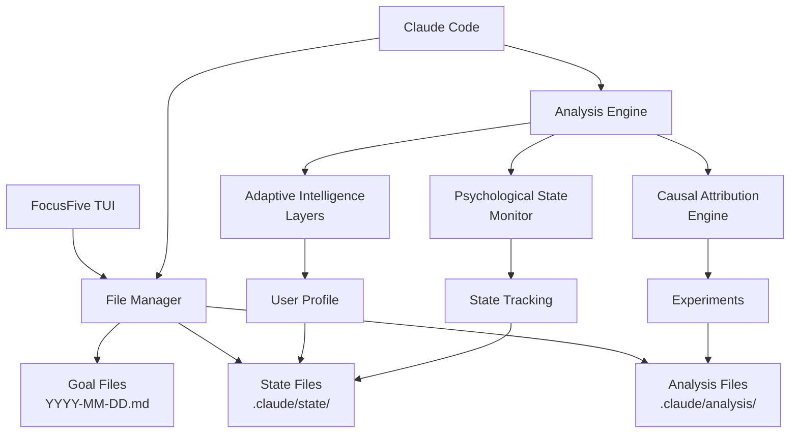

# FocusFive V2: Product Requirements Document
## AI-Powered Personal Development & Business Alignment System

---

## Executive Summary

FocusFive V2 transforms the MVP goal tracking application into an intelligent personal development system that leverages Claude Code's AI capabilities to provide adaptive guidance, causal insights, and psychological state awareness. This PRD defines the technical implementation of advanced features that create a continuously learning system while maintaining the local-first, privacy-preserving architecture.

**Version:** 2.0  
**Status:** Planning  
**Target Release:** Q2 2025  
**Product Owner:** [Your Name]  
**Last Updated:** January 2025

---

## Vision & Strategic Objectives

### Vision Statement
Create the world's first AI-powered personal development system that truly understands the causal relationships between daily actions and life outcomes, adapting its guidance to each user's psychological state and competency level.

### Strategic Objectives
1. **Increase Goal Achievement Rate** from industry average 8% to 40%+ through intelligent intervention
2. **Reduce Time to Insight** from weeks of manual analysis to instant AI-powered understanding
3. **Enable Predictive Intervention** by detecting failure patterns before they manifest
4. **Maintain Privacy-First Architecture** with all intelligence processed locally

### Success Metrics
- User goal completion rate > 40% after 90 days
- Daily engagement rate > 80% after 30 days
- Measurable improvement in user-defined outcome metrics
- Zero data breaches or privacy violations

---

## User Personas & Jobs to Be Done

### Primary Persona: "Executive Emma"
- **Demographics:** 35-45, senior leader, 60+ hour weeks
- **Goals:** Balance high performance with personal wellbeing
- **Pain Points:** Analysis paralysis, lack of time for reflection, difficulty connecting daily actions to strategic outcomes
- **Job to Be Done:** "Help me understand which daily actions actually move the needle on my important goals"

### Secondary Persona: "Founder Frank"
- **Demographics:** 28-38, startup founder, irregular schedule
- **Goals:** Build company while maintaining health and relationships
- **Pain Points:** Constant context switching, reactive rather than proactive, burnout risk
- **Job to Be Done:** "Prevent me from burning out while pushing hard on business goals"

### Tertiary Persona: "Professional Paula"
- **Demographics:** 25-35, individual contributor, ambitious
- **Goals:** Career advancement while developing new skills
- **Pain Points:** Lack of feedback, unclear development path, impostor syndrome
- **Job to Be Done:** "Show me I'm making progress and guide my professional development"

---

## Core Features & Technical Implementation

## 1. Adaptive Intelligence Layers

### Overview
Create a three-tier AI interaction system that automatically evolves based on user competency and engagement patterns.

### Technical Architecture

#### Data Models

```typescript
interface UserProfile {
  currentMode: 'guide' | 'coach' | 'advisor';
  competencyScores: {
    consistency: number;      // 0-1, tracks daily engagement
    complexityHandling: number; // 0-1, goal sophistication
    selfReflection: number;   // 0-1, insight quality
    strategicThinking: number; // 0-1, long-term planning
  };
  interactionHistory: {
    commandsUsed: Map<string, number>;
    questionComplexity: number[];
    goalModificationFrequency: number;
  };
  modeTransitionLog: TransitionEvent[];
}

interface TransitionEvent {
  date: string;
  fromMode: string;
  toMode: string;
  trigger: string;
  competencySnapshot: CompetencyScores;
}
```

#### File Structure
```
goals/.claude/
├── user_profile.json         # Current profile state
├── interaction_logs/          # Historical interactions
│   └── 2025-01-15.json       # Daily interaction log
├── competency_assessments/    # Weekly assessments
│   └── 2025-W03.json         # Weekly competency update
└── mode_configs/             # Mode-specific prompts
    ├── guide.md              # Guide mode instructions
    ├── coach.md              # Coach mode instructions
    └── advisor.md            # Advisor mode instructions
```

#### Mode Behaviors

**Guide Mode (Beginner)**
- Step-by-step daily instructions
- Celebration of small wins
- Simple completion metrics
- Structured prompts for reflection
- Gentle accountability

**Coach Mode (Intermediate)**
- Pattern analysis and insights
- Optimization suggestions
- Comparative analytics
- Behavioral nudges
- Deeper questioning

**Advisor Mode (Advanced)**
- Strategic planning support
- Causal attribution analysis
- Predictive modeling
- Complex trade-off analysis
- System-level thinking

#### Implementation Details

**Competency Assessment Algorithm**
```python
def assess_competency(user_data: UserProfile) -> CompetencyScores:
    """Weekly assessment of user competency"""
    
    # Consistency: Based on streak and daily engagement
    consistency = calculate_streak_score(user_data.streaks) * 0.5 + 
                 calculate_engagement_score(user_data.daily_logins) * 0.5
    
    # Complexity: Based on goal sophistication and interdependencies
    complexity = analyze_goal_complexity(user_data.goals) * 0.6 +
                analyze_task_variety(user_data.tasks) * 0.4
    
    # Self-reflection: Based on reflection quality and insight depth
    reflection = analyze_reflection_quality(user_data.reflections) * 0.7 +
                measure_insight_depth(user_data.insights) * 0.3
    
    # Strategic thinking: Based on long-term planning and goal alignment
    strategic = measure_planning_horizon(user_data.plans) * 0.5 +
               calculate_goal_alignment(user_data.goals) * 0.5
    
    return CompetencyScores(consistency, complexity, reflection, strategic)
```

**Mode Transition Logic**
```python
def determine_mode_transition(scores: CompetencyScores, current: str) -> str:
    """Determine if user should transition to different mode"""
    
    if current == 'guide':
        if scores.consistency > 0.7 and scores.complexity > 0.5:
            return 'coach'
    elif current == 'coach':
        if scores.all_scores() > 0.7 and scores.strategic > 0.75:
            return 'advisor'
        elif scores.consistency < 0.4:  # Regression handling
            return 'guide'
    elif current == 'advisor':
        if scores.consistency < 0.5:  # Struggling with advanced mode
            return 'coach'
    
    return current  # No transition
```

### User Experience

**First-Time User Flow**
1. Initial assessment questionnaire (5 questions)
2. Start in Guide mode by default
3. Daily micro-assessments build competency profile
4. Automatic graduation to Coach mode after demonstrated consistency

**Mode Transition Notification**
```
🎓 Congratulations! You've graduated to Coach mode.

Your consistency and reflection quality show you're ready for deeper insights.
Coach mode will provide pattern analysis and optimization suggestions.

You can always switch modes manually with /set-mode if needed.
```

---

## 2. Causal Attribution Engine

### Overview
Implement sophisticated analysis to identify which specific actions drive goal achievement through temporal correlation, natural experiments, and counterfactual reasoning.

### Technical Architecture

#### Data Models

```typescript
interface CausalAnalysis {
  experiments: NaturalExperiment[];
  correlationMatrix: Map<string, number>;
  causalChains: CausalChain[];
  confidenceIntervals: Map<string, [number, number]>;
  recommendations: CausalRecommendation[];
}

interface NaturalExperiment {
  id: string;
  hypothesis: string;
  variantA: string[];  // dates with intervention
  variantB: string[];  // dates without intervention
  metrics: {
    outcomeA: number;
    outcomeB: number;
    effectSize: number;
    pValue: number;
  };
}

interface CausalChain {
  trigger: string;      // "morning_exercise"
  mediator: string;     // "energy_level"
  outcome: string;      // "work_completion"
  strength: number;     // 0-1 correlation strength
  confidence: number;   // 0-1 confidence in causation
  lag: number;         // hours between trigger and outcome
}
```

#### Analysis Pipeline

**1. Data Collection Phase**
```python
def collect_causal_data(days: int = 30) -> Dict:
    """Collect all relevant data for causal analysis"""
    
    data = {
        'actions': [],      # All completed actions with timestamps
        'outcomes': [],     # Goal completion rates by day
        'context': [],      # Environmental factors (day of week, weather, etc.)
        'states': []        # Psychological states from monitoring
    }
    
    for date in get_date_range(days):
        daily_data = read_goal_file(date)
        data['actions'].extend(extract_actions(daily_data))
        data['outcomes'].append(calculate_outcomes(daily_data))
        data['context'].append(extract_context(date))
        data['states'].append(read_psychological_state(date))
    
    return data
```

**2. Natural Experiment Detection**
```python
def identify_natural_experiments(data: Dict) -> List[NaturalExperiment]:
    """Find naturally occurring A/B tests in user behavior"""
    
    experiments = []
    
    # Find binary behaviors (did/didn't do something)
    binary_actions = find_binary_patterns(data['actions'])
    
    for action in binary_actions:
        days_with = get_days_with_action(action)
        days_without = get_days_without_action(action)
        
        if len(days_with) >= 5 and len(days_without) >= 5:
            # Calculate outcome differences
            outcome_with = average_outcome(days_with)
            outcome_without = average_outcome(days_without)
            
            # Statistical significance test
            effect_size, p_value = calculate_effect_size(
                outcome_with, outcome_without
            )
            
            if p_value < 0.05:  # Significant difference
                experiments.append(NaturalExperiment(
                    action, days_with, days_without, 
                    effect_size, p_value
                ))
    
    return experiments
```

**3. Temporal Correlation Analysis**
```python
def analyze_temporal_correlations(data: Dict) -> Dict:
    """Identify time-lagged correlations between actions and outcomes"""
    
    correlations = {}
    
    for action in data['actions']:
        for outcome in data['outcomes']:
            # Test different time lags (0-48 hours)
            for lag_hours in range(0, 49, 3):
                correlation = calculate_lagged_correlation(
                    action, outcome, lag_hours
                )
                
                if abs(correlation) > 0.3:  # Meaningful correlation
                    key = f"{action}->{outcome}@{lag_hours}h"
                    correlations[key] = correlation
    
    return correlations
```

**4. Counterfactual Reasoning**
```python
def generate_counterfactuals(date: str, data: Dict) -> List[str]:
    """Generate what-if scenarios based on causal model"""
    
    actual_outcome = data['outcomes'][date]
    actual_actions = data['actions'][date]
    
    counterfactuals = []
    
    for experiment in data['experiments']:
        if date not in experiment.variantA:
            # User didn't do the beneficial action
            predicted_improvement = experiment.effect_size
            
            counterfactual = (
                f"If you had {experiment.action} on {date}, "
                f"there's a {experiment.confidence:.0%} chance "
                f"you would have improved {experiment.outcome} "
                f"by {predicted_improvement:.0%}"
            )
            counterfactuals.append(counterfactual)
    
    return counterfactuals
```

### User Experience

**Causal Insights Dashboard**
```
═══ Causal Analysis for January 2025 ═══

🔬 Discovered Patterns:
• Morning exercise → 72% increase in afternoon productivity (p<0.01)
• Sunday planning → 45% better week completion (p<0.05)
• Late night work → -31% next-day performance (p<0.01)

🧪 Natural Experiments:
You inadvertently tested "morning meditation" (8 days with, 7 without)
Result: 23% improvement in daily satisfaction (not significant, p=0.08)
Recommendation: Continue testing for 2 more weeks

💡 Counterfactual Insights:
If you had maintained morning exercise last week:
- Estimated additional 3.5 work tasks completed
- Likely avoided Thursday's energy crash
- 78% probability of maintaining streak

🎯 Optimization Opportunities:
1. Lock in morning exercise (highest ROI action)
2. Eliminate late-night work sessions
3. Test "afternoon walk" intervention
```

---

## 3. Psychological State Monitoring

### Overview
Implement continuous psychological state monitoring through explicit micro-assessments and implicit behavioral signals to enable dynamic goal adjustment.

### Technical Architecture

#### Data Models

```typescript
interface PsychologicalProfile {
  currentState: DailyState;
  patterns: StatePatterns;
  triggers: Map<string, Trigger>;
  interventions: InterventionHistory[];
  riskFactors: RiskAssessment;
}

interface DailyState {
  date: string;
  explicit: {
    energy: number;      // 1-10 self-reported
    motivation: number;  // 1-10 self-reported
    stress: number;     // 1-10 self-reported
    confidence: number; // 1-10 self-reported
  };
  implicit: {
    completionVelocity: number;    // speed of task completion
    taskSelectionPattern: string;  // 'easy_first' | 'hard_first' | 'random'
    revisionFrequency: number;     // goal changes per day
    reflectionSentiment: number;   // -1 to 1 sentiment score
    engagementLatency: number;     // time to start first task
  };
  computed: {
    burnoutRisk: number;    // 0-1 probability
    flowState: boolean;      // in flow state
    energyTrajectory: string; // 'rising' | 'falling' | 'stable'
    recommendedDifficulty: number; // 1-10 optimal challenge
  };
}

interface StatePatterns {
  energyByDayOfWeek: number[];
  motivationDecayRate: number;
  stressTriggers: string[];
  recoveryPatterns: RecoveryPattern[];
  optimalWorkingHours: TimeRange[];
}
```

#### State Detection Pipeline

**1. Explicit Micro-Assessment**
```typescript
// Morning check-in (< 30 seconds)
interface MorningAssessment {
  prompt: "Rate your energy (1-10): ";
  options: "How are you feeling about today's goals?";
  // [Excited | Ready | Neutral | Anxious | Overwhelmed]
}

// Evening reflection prompt
interface EveningAssessment {
  prompt: "Today's stress level (1-10): ";
  followup: "What was the highlight?";
  // Free text, analyzed for sentiment
}
```

**2. Implicit Signal Detection**
```python
def detect_implicit_signals(goals: DailyGoals) -> ImplicitSignals:
    """Extract psychological signals from behavior"""
    
    signals = ImplicitSignals()
    
    # Completion velocity: How quickly tasks are checked off
    first_completion = get_first_completion_time(goals)
    last_completion = get_last_completion_time(goals)
    velocity = calculate_velocity(first_completion, last_completion)
    
    # Task selection pattern: Which tasks are tackled first
    pattern = analyze_task_order(goals)
    if hardest_tasks_first(pattern):
        signals.confidence = 'high'
        signals.energy = 'high'
    elif easiest_tasks_first(pattern):
        signals.confidence = 'low'
        signals.energy = 'variable'
    
    # Revision frequency: How often goals are changed
    revisions = count_goal_revisions(goals)
    if revisions > historical_average * 1.5:
        signals.stress = 'high'
        signals.clarity = 'low'
    
    # Reflection sentiment: Emotional tone of daily reflection
    sentiment = analyze_sentiment(goals.reflection)
    signals.mood = map_sentiment_to_mood(sentiment)
    
    return signals
```

**3. Burnout Detection Algorithm**
```python
def assess_burnout_risk(states: List[DailyState]) -> BurnoutAssessment:
    """Detect early warning signs of burnout"""
    
    risk_score = 0
    warning_signs = []
    
    # Declining completion over time
    completion_trend = calculate_trend(states, 'completion_rate', days=7)
    if completion_trend < -0.2:  # 20% decline
        risk_score += 0.3
        warning_signs.append("Declining task completion")
    
    # Increasing stress without recovery
    stress_trend = calculate_trend(states, 'stress', days=5)
    recovery_days = count_low_stress_days(states, days=7)
    if stress_trend > 0.3 and recovery_days < 2:
        risk_score += 0.4
        warning_signs.append("Sustained high stress")
    
    # Weekend work pattern
    weekend_work = calculate_weekend_completion(states, days=14)
    if weekend_work > 0.8:  # Working most weekends
        risk_score += 0.2
        warning_signs.append("No rest days")
    
    # Negative reflection sentiment
    sentiment_trend = calculate_trend(states, 'reflection_sentiment', days=7)
    if sentiment_trend < -0.3:
        risk_score += 0.2
        warning_signs.append("Increasingly negative outlook")
    
    # Energy depletion pattern
    energy_pattern = analyze_energy_pattern(states, days=7)
    if energy_pattern == 'steadily_declining':
        risk_score += 0.3
        warning_signs.append("Energy depletion")
    
    return BurnoutAssessment(
        risk_score=min(risk_score, 1.0),
        warning_signs=warning_signs,
        recommended_interventions=generate_interventions(risk_score)
    )
```

#### Dynamic Adjustment System

**1. Real-Time Goal Calibration**
```python
def calibrate_goals_to_state(state: DailyState, goals: DailyGoals) -> DailyGoals:
    """Adjust goals based on psychological state"""
    
    calibrated = goals.copy()
    
    if state.explicit.energy < 4:
        # Low energy: Reduce quantity, maintain easy wins
        calibrated = reduce_goal_complexity(calibrated, factor=0.6)
        calibrated = prioritize_energizing_tasks(calibrated)
        add_suggestion("Start with your easiest win to build momentum")
    
    elif state.explicit.energy > 8 and state.computed.flowState:
        # High energy + flow: Increase challenge
        calibrated = add_stretch_goals(calibrated)
        add_suggestion("You're in flow - tackle that ambitious project")
    
    if state.explicit.stress > 7:
        # High stress: Focus on stress-reducing activities
        calibrated = inject_recovery_tasks(calibrated)
        calibrated = defer_non_critical_tasks(calibrated)
        add_suggestion("Include a 10-minute walk or breathing exercise")
    
    if state.computed.burnoutRisk > 0.6:
        # Burnout risk: Enforce boundaries
        calibrated = enforce_minimum_viable_goals(calibrated)
        trigger_burnout_intervention()
    
    return calibrated
```

**2. Intervention Triggers**
```python
def determine_interventions(profile: PsychologicalProfile) -> List[Intervention]:
    """Generate appropriate interventions based on state"""
    
    interventions = []
    
    # Immediate interventions (same day)
    if profile.currentState.computed.burnoutRisk > 0.8:
        interventions.append(
            CriticalIntervention(
                type='burnout_prevention',
                message='Your patterns suggest high burnout risk. Let\'s restructure today.',
                actions=['reduce_goals', 'add_recovery', 'schedule_break']
            )
        )
    
    # Preventive interventions (next day planning)
    if profile.patterns.energyTrajectory == 'falling':
        interventions.append(
            PreventiveIntervention(
                type='energy_management',
                message='Your energy has been declining. Tomorrow\'s plan includes recovery.',
                actions=['lighter_morning', 'energizing_activities', 'earlier_rest']
            )
        )
    
    # Growth interventions (when ready)
    if profile.currentState.computed.flowState and profile.currentState.explicit.confidence > 7:
        interventions.append(
            GrowthIntervention(
                type='challenge_increase',
                message='You\'re in a peak state. Ready for a bigger challenge?',
                actions=['add_stretch_goal', 'tackle_avoided_task', 'learn_new_skill']
            )
        )
    
    return interventions
```

### User Experience

**Daily State Check-In**
```
Good morning! Quick check-in (10 seconds):

Energy level? [1-10]: 6
Today feels: [😊 Excited] [😐 Neutral] [😰 Anxious]

Based on your energy (6) and recent patterns, I've adjusted today's goals:
✅ Moved "Investor deck" to afternoon (your peak focus time)
✅ Added "10-min walk" after lunch (boosts afternoon energy)
✅ Reduced total tasks from 9 to 7 (matching your energy level)

Let's make today sustainable and productive!
```

**Burnout Prevention Alert**
```
⚠️ Wellness Check

I've noticed concerning patterns over the past week:
- Task completion down 30%
- Working every weekend
- Increasingly negative reflections
- No recovery days

Your burnout risk is HIGH (78%).

Immediate recommendations:
1. Today: Complete only your top 3 priorities
2. Tomorrow: Schedule a full recovery day
3. This week: Rebuild with 50% normal workload

Would you like help restructuring your goals for recovery?
```

---

## 4. Integration Architecture

### System Component Interaction



### Data Flow

1. **User Input** → TUI → Markdown files
2. **Claude Analysis Request** → Read files → Process with engines → Generate insights
3. **State Updates** → Analysis results → Update JSON state files → Influence next interaction
4. **Learning Loop** → Accumulated data → Pattern recognition → Improved recommendations

### File System Structure

```
~/FocusFive/
├── goals/
│   ├── 2025-01-15.md           # Daily goal files
│   ├── config.yaml              # User configuration
│   └── .claude/
│       ├── CLAUDE.md            # Auto-loaded context
│       ├── settings.json        # Claude permissions
│       ├── state/
│       │   ├── user_profile.json
│       │   ├── psychological_state.json
│       │   └── current_mode.json
│       ├── analysis/
│       │   ├── causal_model.json
│       │   ├── experiments.json
│       │   └── correlations.json
│       ├── commands/
│       │   ├── analyze-causation.md
│       │   ├── assess-state.md
│       │   └── adapt-guidance.md
│       └── cache/
│           ├── recent_analysis.json
│           └── session_context.json
```

---

## 5. Privacy & Security Requirements

### Data Protection
- **Local-Only Processing**: All analysis happens on user's machine
- **No Cloud Sync**: Unless explicitly opted-in by user
- **Encrypted State Files**: Sensitive psychological data encrypted at rest
- **Audit Logging**: All AI interventions logged for user review

### User Control
- **Mode Override**: Users can manually set their preferred AI mode
- **Data Deletion**: One-command deletion of all analysis data
- **Analysis Opt-Out**: Can use basic features without AI analysis
- **Transparency Reports**: Weekly summary of what AI learned/recommended

---

## 6. Implementation Roadmap

### Phase 1: Foundation (Weeks 1-4)
- [ ] Implement user profile system
- [ ] Create mode detection algorithm
- [ ] Build basic state tracking
- [ ] Develop mode-specific Claude prompts

### Phase 2: Causal Engine (Weeks 5-8)
- [ ] Build data collection pipeline
- [ ] Implement correlation analysis
- [ ] Develop natural experiment detection
- [ ] Create counterfactual reasoning

### Phase 3: State Monitoring (Weeks 9-12)
- [ ] Design micro-assessment UX
- [ ] Build implicit signal detection
- [ ] Implement burnout prevention
- [ ] Create intervention system

### Phase 4: Integration (Weeks 13-16)
- [ ] Connect all systems
- [ ] Optimization and performance tuning
- [ ] User testing and refinement
- [ ] Documentation and training materials

---

## 7. Success Metrics & KPIs

### Primary Metrics
- **Goal Completion Rate**: Target 40%+ after 90 days
- **User Retention**: 80% daily active after 30 days
- **Burnout Prevention**: <5% of users reach high burnout risk
- **Insight Accuracy**: 70%+ of causal insights validated by users

### Secondary Metrics
- **Mode Progression**: 60% of users reach Coach mode within 60 days
- **Intervention Acceptance**: 75% of suggested interventions accepted
- **State Prediction Accuracy**: 80% correlation between predicted and reported states
- **Feature Adoption**: Each V2 feature used by 50%+ of eligible users

### Learning Metrics
- **Model Improvement**: Causal model accuracy improves 5% monthly
- **Personalization Depth**: Average user profile contains 100+ data points
- **Adaptation Speed**: System adapts to user changes within 3 days

---

## 8. Risk Assessment & Mitigation

### Technical Risks

| Risk | Probability | Impact | Mitigation |
|------|------------|--------|------------|
| Claude API changes | Medium | High | Abstract Claude interface, version lock |
| State file corruption | Low | High | Redundant backups, validation checks |
| Performance degradation | Medium | Medium | Lazy loading, data archival strategy |
| Analysis accuracy issues | Medium | Medium | User feedback loops, A/B testing |

### User Experience Risks

| Risk | Probability | Impact | Mitigation |
|------|------------|--------|------------|
| Over-reliance on AI | Medium | High | Emphasize user agency, learning mode |
| Privacy concerns | Low | High | Clear communication, local-only default |
| Complexity overwhelm | Medium | Medium | Progressive disclosure, guided onboarding |
| Intervention fatigue | High | Medium | Smart throttling, user preferences |

---

## 9. Open Questions & Decisions Needed

1. **Monetization Strategy**: Freemium with advanced AI features paid? One-time purchase?
2. **Claude API Costs**: How to handle API costs for heavy users?
3. **Multi-Device Sync**: Optional cloud sync for V2 or wait for V3?
4. **Social Features**: Anonymous pattern sharing across users?
5. **Integration Ecosystem**: Which external tools to integrate first?

---

## 10. Appendix

### A. Glossary
- **Natural Experiment**: Unintentional A/B test created by user behavior variation
- **Competency Score**: Quantified measure of user's goal-tracking sophistication
- **Burnout Risk**: Probability score of user experiencing goal system breakdown
- **Causal Chain**: Identified sequence of actions leading to outcomes

### B. Technical Dependencies
- FocusFive V1 (MVP) completed and stable
- Claude Code API access with sufficient rate limits
- Local file system with 100MB+ available space
- Python/Node.js runtime for analysis scripts

### C. Research References
- Fogg Behavior Model (B=MAT)
- Implementation Intentions (Gollwitzer, 1999)
- Self-Determination Theory (Deci & Ryan)
- Flow State Theory (Csikszentmihalyi)

---

## Document Control

| Version | Date | Author | Changes |
|---------|------|--------|---------|
| 0.1 | 2025-01-15 | [Your Name] | Initial draft |
| 0.2 | TBD | TBD | Incorporate feedback |
| 1.0 | TBD | TBD | Final approval |

---

## Approval Sign-offs

- [ ] Product Owner: ___________________ Date: _______
- [ ] Engineering Lead: ________________ Date: _______
- [ ] UX Lead: ________________________ Date: _______
- [ ] Data/AI Lead: ___________________ Date: _______

---

*This PRD is a living document and will be updated as requirements evolve and new insights emerge from user research and technical feasibility studies.*